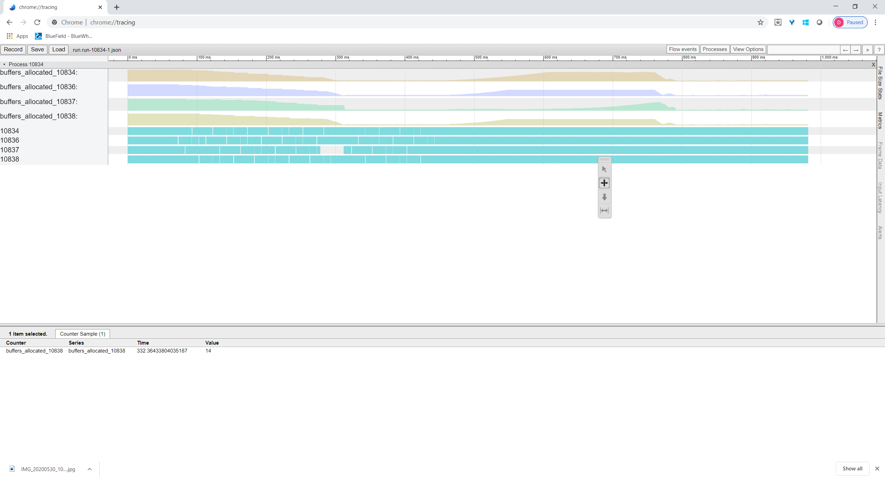

~~~
Disks: Non-Volatile memory controller: Samsung Electronics Co Ltd NVMe SSD Controller 172Xa/172Xb (rev 01) (prog-if 02 [NVM Express])
       Subsystem: Samsung Electronics Co Ltd NVMe SSD Controller 172Xa
~~~

### Test 1

**IO pacing**: `none`

**Configuration**: `config_null_1`

**Initiator**: `fio+SPDK`

| QD         | BW         | WIRE BW    | AVG LAT, us     | BW STDDEV  | L3 Hit Rate     | Bufs in-flight (MiB)      |
|------------|------------|------------|-----------------|------------|-----------------|---------------------------|
| 32         | 129.3      | 137.8114   | 635.6           | 14.9       | 99.2            | 64.0 (8.0)                |
| 64         | 174.1      | 188.4487   | 770.5           | 2.9        | 1.2             | 128.0 (16.0)              |
| 128        | 174.6      | 184.8292   | 1537.5          | 2.5        | .6              | 255.3 (31.9)              |
| 256        | 174.0      | 188.2049   | 3086.3          | 2.9        | .5              | 256.0 (32.0)              |
| 1024       | 174.0      | 181.6536   | 6171.4          | 3.0        | .5              | 255.6 (31.9)              |
| 2048       | 174.3      | 182.9162   | 6159.4          | 2.5        | .5              | 255.3 (31.9)              |

### Test 2

**IO pacing**: `none`

**Configuration**: `config_null_16`

**Initiator**: `fio+SPDK`

**Target CPU mask:** 0xF

| QD         | BW         | WIRE BW    | AVG LAT, us     | BW STDDEV  | L3 Hit Rate     | Bufs in-flight (MiB)      |
|------------|------------|------------|-----------------|------------|-----------------|---------------------------|
| 32         | 184.8      | 196.329    | 362.8           | .1         | 84.6            | 17.0 (2.1)                |
| 64         | 184.8      | 196.3332   | 725.7           | 0          | 78.8            | 84.6 (10.5)               |
| 128        | 184.8      | 196.3337   | 1451.7          | 0          | 77.2            | 187.6 (23.4)              |
| 256        | 184.8      | 196.3346   | 2904.2          | .1         | 59.8            | 398.6 (49.8)              |
| 1024       | 184.7      | 196.3351   | 11342.3         | .2         | 52.5            | 860.6 (107.5)             |
| 2048       | 184.5      | 196.3348   | 13496.5         | .7         | 52.2            | 949.0 (118.6)             |

### Test 3

**IO pacing**: `none`

**Configuration**: `config_nvme`

**Initiator**: `fio+SPDK`

**Target CPU mask:** 0xF
| QD   | BW    | WIRE BW  | AVG LAT, us | BW STDDEV | L3 Hit Rate | Bufs in-flight (MiB) |
|------|-------|----------|-------------|-----------|-------------|----------------------|
| 32   | 180.4 | 191.7512 | 371.6       | .6        | 98.9        | 34.0 (4.2)           |
| 36   | 184.6 | 196.2118 | 408.6       | .2        | 96.8        | 35.6 (4.4)           |
| 40   | 184.4 | 196.2301 | 454.5       | .3        | 95.3        | 37.3 (4.6)           |
| 44   | 178.4 | 194.4846 | 516.7       | 1.8       | 87.9        | 38.3 (4.7)           |
| 48   | 155.5 | 169.8995 | 647.0       | 2.2       | 68.5        | 43.0 (5.3)           |
| 64   | 140.8 | 149.771  | 952.8       | 2.7       | 64.2        | 56.3 (7.0)           |
| 128  | 133.2 | 146.006  | 2013.7      | 3.6       | 62.0        | 150.6 (18.8)         |
| 256  | 130.8 | 148.2463 | 4101.8      | 3.8       | 55.5        | 342.3 (42.7)         |
| 1024 | 124.8 | 130.8902 | 16861.8     | 3.6       | 56.0        | 764.6 (95.5)         |
| 2048 | 120.0 | 129.6406 | 23393.1     | 3.9       | 51.8        | 944.6 (118.0)        |

### Test 4

**IO pacing**: `Limit number of SPDK buffers to 96`

**Configuration**: `NUM_SHARED_BUFFERS=96 config_null_16`

**Initiator**: `fio+SPDK`

**Target CPU mask:** 0xF

| QD         | BW         | WIRE BW    | AVG LAT, us     | BW STDDEV  | L3 Hit Rate     | Bufs in-flight (MiB)      |
|------------|------------|------------|-----------------|------------|-----------------|---------------------------|
| 32         | 184.8      | 196.3354   | 362.8           | .1         | 97.4            | 17.3 (2.1)                |
| 64         | 184.8      | 196.332    | 725.8           | .1         | 94.3            | 38.3 (4.7)                |
| 128        | 184.8      | 196.3329   | 1451.8          | .1         | 93.0            | 56.3 (7.0)                |
| 256        | 184.8      | 196.3356   | 2903.7          | 0          | 92.4            | 52.0 (6.5)                |
| 1024       | 179.4      | 196.3353   | 11982.5         | .3         | 93.8            | 66.0 (8.2)                |
| 2048       | 184.7      | 196.336    | 23248.6         | .8         | 89.2            | 96.0 (12.0)               |

### Test 5

**IO pacing**: `Limit number of SPDK buffers to 96`

**Configuration**: `NUM_SHARED_BUFFERS=96 BUF_CACHE_SIZE=6 config_nvme`

**Initiator**: `fio+SPDK`

**Target CPU mask:** 0xF

| QD         | BW         | WIRE BW    | AVG LAT, us     | BW STDDEV  | L3 Hit Rate     | Bufs in-flight (MiB)      |
|------------|------------|------------|-----------------|------------|-----------------|---------------------------|
| 32         | 180.9      | 191.7578   | 370.6           | .6         | 99.4            | 32.0 (4.0)                |
| 64         | 183.3      | 196.2312   | 731.6           | 1.3        | 88.6            | 47.6 (5.9)                |
| 128        | 183.2      | 196.2073   | 1464.5          | 1.4        | 88.3            | 53.6 (6.7)                |
| 256        | 183.2      | 196.1018   | 2929.6          | 1.4        | 88.4            | 70.0 (8.7)                |
| 1024       | 183.0      | 196.0663   | 11733.6         | 1.3        | 88.4            | 66.3 (8.2)                |
| 2048       | 174.2      | 195.8848   | 24271.7         | 3.2        | 86.7            | 76.3 (9.5)                |

### Test 6

Stability tests. Check variation of results between multiple runs for
different queue depths.

**IO pacing**: `Limit number of SPDK buffers to 96`

**Configuration**: `NUM_SHARED_BUFFERS=96 BUF_CACHE_SIZE=6 config_nvme`

**Initiator**: `fio+SPDK`

| QD         | BW         | WIRE BW    | AVG LAT, us     | BW STDDEV  | L3 Hit Rate     | Bufs in-flight (MiB)      |
|------------|------------|------------|-----------------|------------|-----------------|---------------------------|
| 32         | 181.0      | 192.7453   | 370.4           | .6         | 99.4            | 31.0 (3.8)                |
| 32         | 180.9      | 192.7751   | 370.7           | .6         | 99.3            | 31.3 (3.9)                |
| 32         | 181.0      | 192.7179   | 370.5           | .6         | 99.2            | 31.0 (3.8)                |
| 32         | 180.8      | 191.7542   | 370.8           | .6         | 99.4            | 32.0 (4.0)                |
| 32         | 181.0      | 192.8969   | 370.4           | .6         | 99.4            | 32.0 (4.0)                |
| 32         | 180.8      | 192.8457   | 370.7           | .6         | 99.4            | 32.6 (4.0)                |
| 32         | 181.0      | 192.9574   | 370.4           | .6         | 99.4            | 34.0 (4.2)                |
| 32         | 180.8      | 192.8777   | 370.7           | .7         | 99.3            | 32.0 (4.0)                |
| 32         | 180.7      | 192.1953   | 371.0           | .9         | 99.4            | 33.6 (4.2)                |
| 32         | 180.8      | 192.6212   | 370.8           | .7         | 99.4            | 32.3 (4.0)                |
| 256        | 183.1      | 196.1463   | 2930.8          | 1.4        | 89.4            | 60.0 (7.5)                |
| 256        | 183.1      | 196.1126   | 2931.0          | 1.4        | 87.3            | 53.0 (6.6)                |
| 256        | 183.2      | 196.0903   | 2929.7          | 1.4        | 88.0            | 55.6 (6.9)                |
| 256        | 183.0      | 196.1878   | 2932.1          | 1.4        | 88.0            | 76.6 (9.5)                |
| 256        | 183.0      | 196.1691   | 2933.1          | 1.5        | 87.4            | 61.0 (7.6)                |
| 256        | 183.1      | 196.0661   | 2930.4          | 1.5        | 88.9            | 58.6 (7.3)                |
| 256        | 183.0      | 196.1019   | 2932.5          | 1.5        | 88.2            | 74.6 (9.3)                |
| 256        | 183.0      | 195.978    | 2931.9          | 1.5        | 87.2            | 64.3 (8.0)                |
| 256        | 183.1      | 196.0122   | 2930.5          | 1.3        | 88.5            | 64.3 (8.0)                |
| 256        | 183.1      | 196.1323   | 2930.7          | 1.4        | 88.1            | 69.0 (8.6)                |
| 1024       | 182.7      | 196.1498   | 11752.6         | 1.6        | 87.3            | 70.0 (8.7)                |
| 1024       | 182.5      | 195.8226   | 11763.6         | 1.6        | 86.8            | 68.6 (8.5)                |
| 1024       | 182.6      | 196.1195   | 11755.7         | 1.6        | 87.7            | 80.6 (10.0)               |
| 1024       | 182.3      | 195.8221   | 11776.0         | 1.7        | 86.8            | 74.3 (9.2)                |
| 1024       | 170.8      | 195.2426   | 12570.1         | 7.7        | 86.0            | 85.3 (10.6)               |
| 1024       | 182.6      | 195.8331   | 11760.9         | 1.6        | 87.9            | 70.0 (8.7)                |
| 1024       | 183.0      | 196.1179   | 11736.0         | 1.4        | 88.0            | 63.6 (7.9)                |
| 1024       | 182.8      | 196.1604   | 11746.3         | 1.4        | 88.8            | 63.0 (7.8)                |
| 1024       | 179.2      | 196.0784   | 12215.6         | 3.1        | 87.2            | 69.3 (8.6)                |
| 1024       | 182.9      | 195.9947   | 11736.5         | 1.3        | 90.4            | 67.3 (8.4)                |
| 2048       | 165.0      | 195.6752   | 23453.7         | 7.7        | 87.0            | 69.3 (8.6)                |
| 2048       | 114.1      | 11.7483    | 36052.1         | 20.4       | 90.5            | 61.3 (7.6)                |
| 2048       | 169.9      | 195.7072   | 25239.6         | 8.2        | 86.3            | 72.3 (9.0)                |
| 2048       | 170.3      | 195.7915   | 25208.8         | 6.9        | 88.0            | 80.6 (10.0)               |
| 2048       | 159.7      | 195.8313   | 24719.4         | 10.2       | 87.8            | 67.0 (8.3)                |
| 2048       | 182.8      | 195.9518   | 23482.9         | 1.8        | 88.6            | 66.6 (8.3)                |
| 2048       | 159.5      | 196.1289   | 24218.8         | 8.9        | 97.3            | 68.6 (8.5)                |
| 2048       | 156.2      | 196.1796   | 22841.8         | 13.1       | 97.3            | 74.6 (9.3)                |
| 2048       | 171.9      | 195.8958   | 24800.2         | 7.5        | 86.3            | 77.3 (9.6)                |
| 2048       | 152.1      | 196.0882   | 26380.5         | 10.3       | 88.0            | 56.3 (7.0)                |

### Test 7

Check performance effect of number of target cores.

**IO pacing**: `Limit number of SPDK buffers to 96`

**Configuration**: `NUM_SHARED_BUFFERS=96 BUF_CACHE_SIZE=$((num_buffers/num_cores)) config_nvme`

**Initiator**: `fio+SPDK`

Target cores 16 (0xFFFF). Buffer cache size 6

| QD         | BW         | WIRE BW    | AVG LAT, us     | BW STDDEV  | L3 Hit Rate     | Bufs in-flight (MiB)      |
|------------|------------|------------|-----------------|------------|-----------------|---------------------------|
| 32         | 153.2      | 186.9358   | 437.7           | 15.5       | 99.5            | 12.0 (1.5)                |
| 64         | 172.6      | 193.1896   | 777.2           | 10.4       | 96.0            | 31.0 (3.8)                |
| 128        | 173.9      | 194.2205   | 1542.7          | 9.1        | 96.2            | 33.3 (4.1)                |
| 256        | 176.5      | 194.7853   | 3041.5          | 6.9        | 95.5            | 32.0 (4.0)                |
| 1024       | 156.5      | 195.4675   | 12362.3         | 15.8       | 91.8            | 38.3 (4.7)                |
| 2048       | 119.9      | 0          | 27286.3         | 19.4       | 92.1            | 60.0 (7.5)                |
| 32         | 180.8      | 192.6718   | 370.9           | .8         | 99.4            | 34.0 (4.2)                |
| 64         | 183.0      | 196.1263   | 733.0           | 1.6        | 88.7            | 53.3 (6.6)                |
| 128        | 183.0      | 195.8787   | 1466.2          | 1.6        | 89.0            | 59.6 (7.4)                |
| 256        | 182.8      | 195.9895   | 2935.5          | 1.6        | 88.8            | 68.3 (8.5)                |
| 1024       | 182.3      | 195.9019   | 12142.4         | 1.8        | 87.4            | 82.0 (10.2)               |
| 2048       | 166.1      | 195.6884   | 22845.2         | 10.9       | 87.7            | 77.6 (9.7)                |
| 32         | 181.0      | 192.5283   | 370.5           | .6         | 99.4            | 32.6 (4.0)                |
| 64         | 183.2      | 196.1701   | 732.2           | 1.4        | 88.6            | 48.0 (6.0)                |
| 128        | 183.0      | 195.8798   | 1466.0          | 1.5        | 87.7            | 48.3 (6.0)                |
| 256        | 183.2      | 196.1189   | 2930.1          | 1.4        | 89.6            | 52.3 (6.5)                |
| 1024       | 183.0      | 196.2159   | 11734.6         | 1.3        | 89.4            | 58.6 (7.3)                |
| 2048       | 182.6      | 196.1293   | 23509.2         | 1.8        | 87.2            | 67.0 (8.3)                |
| 32         | 179.2      | 190.7738   | 374.0           | .7         | 99.4            | 31.3 (3.9)                |
| 64         | 183.9      | 196.2118   | 729.4           | 1.0        | 92.2            | 48.3 (6.0)                |
| 128        | 184.3      | 196.2666   | 1455.6          | .5         | 93.5            | 48.0 (6.0)                |
| 256        | 184.5      | 196.2601   | 2908.8          | .3         | 95.1            | 48.0 (6.0)                |
| 1024       | 184.5      | 196.2306   | 11635.5         | .2         | 95.4            | 48.0 (6.0)                |
| 2048       | 184.5      | 196.1993   | 23277.8         | .1         | 96.3            | 48.0 (6.0)                |
| 32         | 166.7      | 177.5174   | 402.2           | .5         | 99.5            | 64.0 (8.0)                |
| 64         | 177.2      | 189.0323   | 757.0           | 3.1        | 92.8            | 96.0 (12.0)               |
| 128        | 173.8      | 184.4002   | 1544.0          | 1.3        | 93.2            | 96.0 (12.0)               |
| 256        | 148.8      | 169.6696   | 3606.2          | 6.7        | 92.4            | 96.0 (12.0)               |
| 1024       | 66.5       | 21.5698    | 34186.5         | 16.9       | 92.9            | 96.0 (12.0)               |
| 2048       | |          | 96.0       | 91.2            | |          |                 |  ()                       |

### Test 8

Check performance effects of buffer cache size.

**IO pacing**: `Limit number of SPDK buffers to 96`

**Configuration**: `NUM_SHARED_BUFFERS=96 BUF_CACHE_SIZE=$buf_cache_size config_nvme`

**Initiator**: `fio+SPDK`

Buffer cache size 6.

| QD         | BW         | WIRE BW    | AVG LAT, us     | BW STDDEV  | L3 Hit Rate     | Bufs in-flight (MiB)      |
|------------|------------|------------|-----------------|------------|-----------------|---------------------------|
| 32         | 153.3      | 186.9712   | 437.5           | 15.6       | 99.5            | 11.0 (1.3)                |
| 64         | 169.2      | 192.4679   | 792.9           | 11.9       | 96.7            | 28.0 (3.5)                |
| 128        | 172.0      | 192.624    | 1559.8          | 10.8       | 96.0            | 36.0 (4.5)                |
| 256        | 176.9      | 194.9639   | 3034.1          | 6.6        | 95.7            | 40.0 (5.0)                |
| 1024       | 155.9      | 195.5284   | 12814.8         | 9.9        | 94.8            | 29.0 (3.6)                |
| 2048       | 126.2      | 192.0534   | 23192.4         | 16.7       | 90.9            | 58.3 (7.2)                |
| 32         | 165.1      | 187.1082   | 406.1           | 11.8       | 99.5            | 35.3 (4.4)                |
| 64         | 172.3      | 194.7679   | 778.4           | 10.3       | 96.4            | 43.0 (5.3)                |
| 128        | 175.4      | 194.5688   | 1530.0          | 8.2        | 97.2            | 58.0 (7.2)                |
| 256        | 176.4      | 195.7395   | 3043.4          | 7.0        | 97.3            | 71.6 (8.9)                |
| 1024       | 171.7      | 192.8975   | 12885.2         | 8.4        | 96.9            | 60.3 (7.5)                |
| 2048       | 167.6      | 194.4482   | 23841.5         | 8.2        | 96.1            | 52.0 (6.5)                |
| 32         | 163.4      | 186.8523   | 410.4           | 12.2       | 99.4            | 32.3 (4.0)                |
| 64         | 172.0      | 192.6385   | 779.8           | 10.8       | 96.1            | 59.0 (7.3)                |
| 128        | 174.6      | 194.3423   | 1536.7          | 8.8        | 95.4            | 58.3 (7.2)                |
| 256        | 175.3      | 194.3333   | 3062.2          | 8.8        | 95.6            | 63.0 (7.8)                |
| 1024       | 180.0      | 195.0608   | 12322.4         | 5.1        | 96.5            | 57.6 (7.2)                |
| 2048       | 177.7      | 195.4205   | 23782.3         | 5.7        | 96.5            | 64.0 (8.0)                |
| 32         | 163.9      | 186.6251   | 409.0           | 12.1       | 99.3            | 37.3 (4.6)                |
| 64         | 170.4      | 191.8494   | 787.1           | 11.1       | 97.4            | 30.0 (3.7)                |
| 128        | 164.4      | 182.1393   | 1631.7          | 7.8        | 97.9            | 62.0 (7.7)                |

### Test 10

Check performance effect of number of data buffers with 4 cores. All
buffers are shared equally between all threads at start with
`BufCacheSize` parameter.

**IO pacing**: `Limit number of SPDK buffers to 96`

**Configuration**: `NUM_SHARED_BUFFERS=$num_buffers BUF_CACHE_SIZE=$((num_buffers/4)) config_nvme`

**Initiator**: `fio+SPDK`

**CPU mask**: 0xF

| Num buffers | Buf cache | QD         | BW         | WIRE BW    | AVG LAT, us     | BW STDDEV  | L3 Hit Rate     | Bufs in-flight (MiB)      |
|-------------|-----------|------------|------------|------------|-----------------|------------|-----------------|---------------------------|
| 128         | 32        | 256        | 139.2      | 146.5161   | 3854.6          | 3.2        | 65.1            | 89.3 (11.1)               |
| 128         | 32        | 1024       | 137.0      | 149.9497   | 15668.3         | 3.3        | 65.5            | 90.0 (11.2)               |
| 96          | 24        | 256        | 182.0      | 196.1142   | 2949.3          | 4.1        | 89.5            | 63.0 (7.8)                |
| 96          | 24        | 1024       | 183.0      | 195.909    | 11735.1         | 1.5        | 88.6            | 69.3 (8.6)                |
| 64          | 16        | 256        | 181.3      | 192.8647   | 2959.8          | .3         | 99.5            | 48.6 (6.0)                |
| 64          | 16        | 1024       | 167.0      | 178.5434   | 12858.3         | 4.9        | 99.4            | 39.6 (4.9)                |
| 48          | 12        | 256        | 157.4      | 166.9114   | 3409.5          | 1.4        | 99.5            | 38.0 (4.7)                |
| 48          | 12        | 1024       | 146.9      | 155.3006   | 14619.3         | 2.4        | 99.4            | 33.0 (4.1)                |
| 44          | 11        | 256        | 151.3      | 159.5022   | 3547.7          | 3.5        | 99.5            | 32.3 (4.0)                |
| 44          | 11        | 1024       | 140.1      | 148.4166   | 15330.6         | 2.8        | 99.4            | 31.6 (3.9)                |
| 40          | 10        | 256        | 141.1      | 150.4636   | 3804.3          | 2.1        | 99.5            | 32.3 (4.0)                |
| 40          | 10        | 1024       | 128.3      | 139.4802   | 16754.5         | 4.9        | 99.4            | 28.6 (3.5)                |
| 36          | 9         | 256        | 132.7      | 141.3987   | 4043.7          | 2.6        | 99.5            | 28.0 (3.5)                |
| 36          | 9         | 1024       | 124.2      | 130.5055   | 17292.0         | 3.4        | 99.4            | 26.0 (3.2)                |
| 32          | 8         | 256        | 121.9      | 129.0161   | 4402.5          | 2.6        | 99.5            | 26.0 (3.2)                |
| 32          | 8         | 1024       | 108.0      | 117.5969   | 19883.4         | 5.0        | 99.4            | 22.6 (2.8)                |
| 24          | 6         | 256        | 95.6       | 102.2675   | 5613.2          | 2.0        | 99.5            | 20.0 (2.5)                |
| 24          | 6         | 1024       | 86.9       | 93.4977    | 24717.3         | 3.9        | 99.4            | 18.0 (2.2)                |
| 16          | 4         | 256        | 65.6       | 69.5475    | 8182.5          | 1.4        | 99.4            | 13.6 (1.7)                |
| 16          | 4         | 1024       | 65.1       | 68.7459    | 32963.8         | 1.7        | 99.4            | 11.6 (1.4)                |

### Test 11

Split each NVMe disk into 3 partitions with SPDK split block device
and build delay block device on top of some partitions.

IO depth is shared equally between all disks. FIO runs 3 jobs with
queue depth of 85 or 341 each. This gives us total IO depth of 255 and
1023 per initiator respectively.

**IO pacing**: `Number of buffers`

**Configuration**: `config_nvme_split3_delay`

**Initiator**: `fio+SPDK`

**CPU mask**: 0xF

| Num buffers | Num delay bdevs | QD  | BW    | WIRE BW  | AVG LAT, us | BW STDDEV | L3 Hit Rate | Bufs in-flight (MiB) |
|-------------|-----------------|-----|-------|----------|-------------|-----------|-------------|----------------------|
| 96          | 0               | 85  | 182.4 | 196.2003 | 2931.2      | 1.4       | 94.4        | 57.6 (7.2)           |
| 96          | 0               | 341 | 172.7 | 196.2555 | 12424.5     | 2.7       | 93.8        | 44.6 (5.5)           |
| 96          | 16              | 85  | 157.4 | 171.0941 | 3398.7      | .4        | 93.6        | 75.0 (9.3)           |
| 96          | 16              | 341 | 136.1 | 161.4393 | 16238.9     | 2.9       | 92.5        | 81.0 (10.1)          |
| 96          | 32              | 85  | 109.4 | 116.0836 | 4886.2      | 1.5       | 88.2        | 75.0 (9.3)           |
| 96          | 32              | 341 | 112.3 | 111.87   | 19210.5     | 4.3       | 87.0        | 84.3 (10.5)          |
| 48          | 0               | 85  | 157.0 | 166.1663 | 3404.0      | .6        | 99.5        | 35.3 (4.4)           |
| 48          | 0               | 341 | 129.4 | 166.1863 | 17297.6     | 3.9       | 99.4        | 39.3 (4.9)           |
| 48          | 16              | 85  | 88.9  | 92.3295  | 6016.8      | 2.0       | 99.3        | 38.6 (4.8)           |
| 48          | 16              | 341 | 89.7  | 89.1863  | 24470.7     | 3.3       | 99.1        | 46.0 (5.7)           |
| 48          | 32              | 85  | 56.5  | 58.6304  | 9466.7      | 1.3       | 99.1        | 39.3 (4.9)           |
| 48          | 32              | 341 | 59.5  | 57.3809  | 36071.5     | 2.6       | 98.9        | 48.0 (6.0)           |

Run2
| Num buffers | Num delay bdevs | QD  | BW    | WIRE BW  | AVG LAT, us | BW STDDEV | L3 Hit Rate | Bufs in-flight (MiB) |
|-------------|-----------------|-----|-------|----------|-------------|-----------|-------------|----------------------|
| 96          | 0               | 85  | 183.8 | 196.2727 | 2908.2      | .3        | 94.8        | 64.3 (8.0)           |
| 96          | 0               | 341 | 180.6 | 196.2773 | 11732.6     | .3        | 94.8        | 56.6 (7.0)           |
| 96          | 16              | 85  | 159.1 | 170.2384 | 3359.0      | 1.4       | 93.5        | 72.0 (9.0)           |
| 96          | 16              | 341 | 132.0 | 161.4572 | 16757.4     | 2.7       | 92.2        | 79.6 (9.9)           |
| 96          | 32              | 85  | 109.5 | 115.4534 | 4883.8      | 1.4       | 88.3        | 79.3 (9.9)           |
| 96          | 32              | 341 | 106.0 | 111.1116 | 20804.9     | 3.5       | 87.1        | 90.3 (11.2)          |
| 48          | 0               | 85  | 155.0 | 165.1953 | 3449.3      | 1.8       | 99.3        | 40.0 (5.0)           |
| 48          | 0               | 341 |       |          | 34.0        | 98.5      |             |                      |
| 48          | 16              | 85  | 87.0  | 92.573   | 6279.9      | 2.2       | 99.3        | 43.0 (5.3)           |
| 48          | 16              | 341 | 88.5  | 88.9342  | 24263.6     | 3.0       | 99.1        | 46.3 (5.7)           |
| 48          | 32              | 85  | 56.1  | 58.1953  | 9537.8      | 1.2       | 99.0        | 42.6 (5.3)           |
| 48          | 32              | 341 | 58.3  | 57.2011  | 36806.4     | 2.3       | 99.0        | 44.6 (5.5)           |

### Test 12

Split each NVMe disk into 3 partitions with SPDK split block device
and build delay block device on top of some partitions.

FIO runs 3 jobs with 16 disks each. Job 1 is always delay devices, job
2 may be good (16 delay bdevs) or delay (32 dely bdevs), job 3 is
always good. IO depth is fixed to 256 or 1024 for job 3. For jobs 1
and 2 it is set to value in QD column in the table below. For 32 delay
bdevs effective IO depth is twice the QD since we have 2 jobs each
with it's own IO depth.

**IO pacing**: `Number of buffers`

**Configuration**: `config_nvme_split3_delay`

**Initiator**: `fio+SPDK`

**CPU mask**: 0xF

Job 3 QD is 1024.

| Num buffers | Num delay bdevs | QD | BW    | WIRE BW  | AVG LAT, us | BW STDDEV | L3 Hit Rate | Bufs in-flight (MiB) |
|-------------|-----------------|----|-------|----------|-------------|-----------|-------------|----------------------|
| 96          | 16              | 1  | 182.2 | 196.3114 | 11805.8     | 2.3       | 90.3        | 69.3 (8.6)           |
| 96          | 16              | 2  | 184.3 | 196.3269 | 11697.1     | .2        | 95.5        | 46.6 (5.8)           |
| 96          | 16              | 4  | 184.4 | 196.3296 | 11733.7     | .1        | 96.2        | 44.3 (5.5)           |
| 96          | 16              | 8  | 184.5 | 196.2966 | 11823.3     | .1        | 97.8        | 44.3 (5.5)           |
| 96          | 16              | 16 | 182.1 | 195.5459 | 12159.8     | 2.5       | 98.0        | 47.6 (5.9)           |
| 96          | 16              | 32 | 170.5 | 193.8424 | 13381.4     | 3.6       | 97.8        | 47.0 (5.8)           |
| 96          | 16              | 64 | 162.5 | 189.0824 | 14875.1     | 4.2       | 97.3        | 61.6 (7.7)           |

| Num buffers | Num delay bdevs | QD | BW    | WIRE BW  | AVG LAT, us | BW STDDEV | L3 Hit Rate | Bufs in-flight (MiB) |
|-------------|-----------------|----|-------|----------|-------------|-----------|-------------|----------------------|
| 96          | 32              | 1  | 176.9 | 196.304  | 12164.5     | 4.6       | 92.5        | 63.3 (7.9)           |
| 96          | 32              | 2  | 182.9 | 196.3285 | 11785.4     | 2.3       | 95.3        | 51.6 (6.4)           |
| 96          | 32              | 4  | 184.4 | 196.3102 | 11733.8     | .2        | 96.8        | 45.0 (5.6)           |
| 96          | 32              | 8  | 173.3 | 195.914  | 12582.7     | 5.6       | 98.2        | 56.0 (7.0)           |
| 96          | 32              | 16 | 180.9 | 192.0799 | 12243.0     | .3        | 98.1        | 49.6 (6.2)           |
| 96          | 32              | 32 | 176.7 | 186.8075 | 12911.3     | .5        | 97.3        | 49.3 (6.1)           |
| 96          | 32              | 64 | 158.6 | 176.6669 | 15227.0     | 3.4       | 95.5        | 54.6 (6.8)           |

#### Enumerating through pacing periods

CPU mask 0xF0, num cores 4, IO pacer period 5750, adjusted period 23000
| Num delay bdevs | QD | BW    | WIRE BW  | AVG LAT, us | BW STDDEV | L3 Hit Rate | Bufs in-flight (MiB) | Pacer period, us |
|-----------------|----|-------|----------|-------------|-----------|-------------|----------------------|------------------|
| 16              | 1  | 174.4 | 191.5031 | 12342.8     | 3.2       | 98.4        | 35.3 (4.4)           | 30.1             |
| 16              | 2  | 170.2 | 105.488  | 12694.2     | 5.0       | 97.9        | 49.0 (6.1)           | 29.1             |
| 16              | 4  | 178.0 | 191.4605 | 12162.5     | 1.9       | 98.0        | 42.6 (5.3)           | 28.4             |
| 16              | 8  | 149.0 | 163.7612 | 14644.7     | 6.9       | 48.8        | 1372.3 (171.5)       | 28.6             |
| 16              | 16 | 116.4 | 129.2062 | 19152.0     | 1.8       | 45.7        | 1393.0 (174.1)       | 30.0             |
| 16              | 32 | 108.9 | 120.6557 | 20970.3     | 1.6       | 30.6        | 1262.6 (157.8)       | 31.2             |
| 16              | 64 | 105.5 | 109.9268 | 22909.8     | 1.4       | 25.4        | 1094.0 (136.7)       | 32.2             |
| 32              | 1  | 173.2 | 191.7969 | 12289.6     | 4.5       | 98.8        | 41.0 (5.1)           | 30.2             |
| 32              | 2  | 177.8 | 190.4909 | 12127.0     | 1.7       | 97.5        | 44.6 (5.5)           | 28.5             |
| 32              | 4  | 156.8 | 189.69   | 13846.9     | 7.6       | 96.9        | 1121.0 (140.1)       | 28.5             |
| 32              | 8  | 116.1 | 133.6228 | 18754.9     | 5.4       | 80.5        | 1010.3 (126.2)       | 30.2             |
| 32              | 16 | 105.6 | 110.2712 | 20977.4     | 2.1       | 38.2        | 1093.6 (136.7)       | 31.7             |
| 32              | 32 | 104.5 | 110.6193 | 21850.1     | 1.6       | 27.8        | 1039.3 (129.9)       | 32.9             |
| 32              | 64 | 104.3 | 109.8095 | 23199.3     | 1.3       | 23.5        | 1029.0 (128.6)       | 33.8             |

CPU mask 0xF0, num cores 4, IO pacer period 6000, adjusted period 24000
| Num delay bdevs | QD | BW    | WIRE BW  | AVG LAT, us | BW STDDEV | L3 Hit Rate | Bufs in-flight (MiB) | Pacer period, us |
|-----------------|----|-------|----------|-------------|-----------|-------------|----------------------|------------------|
| 16              | 1  | 171.4 | 183.7849 | 12488.4     | 1.6       | 98.8        | 30.0 (3.7)           | 30.8             |
| 16              | 2  | 172.0 | 183.8773 | 12533.3     | .9        | 98.1        | 32.0 (4.0)           | 29.2             |
| 16              | 4  | 171.5 | 182.634  | 12621.2     | 1.6       | 97.9        | 37.0 (4.6)           | 28.8             |
| 16              | 8  | 170.8 | 182.7272 | 12769.6     | 1.9       | 96.7        | 42.0 (5.2)           | 28.5             |
| 16              | 16 | 171.1 | 182.4898 | 12950.5     | 1.3       | 94.5        | 50.3 (6.2)           | 28.3             |
| 16              | 32 | 108.6 | 112.0692 | 21019.0     | 1.7       | 29.6        | 1019.6 (127.4)       | 29.6             |
| 16              | 64 | 106.0 | 109.8919 | 22795.3     | 1.5       | 25.2        | 1283.6 (160.4)       | 30.7             |
| 32              | 1  | 170.1 | 147.1401 | 12595.3     | 2.3       | 98.8        | 29.0 (3.6)           | 31.5             |
| 32              | 2  | 161.1 | 155.1314 | 13381.5     | 3.5       | 98.9        | 35.3 (4.4)           | 30.2             |
| 32              | 4  | 170.5 | 182.8578 | 12697.9     | 2.2       | 97.3        | 32.6 (4.0)           | 29.6             |
| 32              | 8  | 170.2 | 182.2287 | 12819.0     | 2.0       | 95.0        | 50.3 (6.2)           | 29.1             |
| 32              | 16 | 105.8 | 110.4156 | 20937.1     | 2.1       | 38.4        | 1085.3 (135.6)       | 30.7             |
| 32              | 32 | 105.9 | 113.7642 | 21572.8     | 1.7       | 30.4        | 746.3 (93.2)         | 32.0             |
| 32              | 64 | 104.4 | 109.8887 | 23162.7     | 1.3       | 24.0        | 927.0 (115.8)        | 33.0             |

### Test 13

Test latencies with different configurations.

**IO pacing**: `N/A`

**Configuration**: `config_null_16`, `config_nvme`, `config_nvme_split3_delay`

**Initiator**: `fio+SPDK`

**CPU mask**: 0xF

One initiator: spdk04

16 Null disks
| QD | BW   | WIRE BW | AVG LAT, us | BW STDDEV | L3 Hit Rate | Bufs in-flight (MiB) |
|----|------|---------|-------------|-----------|-------------|----------------------|
| 1  | 52.0 | 52.0158 | 19.9        | 1.7       | 99.0        | 0 (0)                |

Local single NVMe disk (SPDK perf)
| QD | BW | WIRE BW | AVG LAT, us | BW STDDEV | L3 Hit Rate |
|----|----|---------|-------------|-----------|-------------|
| 1  | 5.2|         | 200.04      |           |             |

16 NVMe disks
| QD | BW   | WIRE BW | AVG LAT, us | BW STDDEV | L3 Hit Rate | Bufs in-flight (MiB) |
|----|------|---------|-------------|-----------|-------------|----------------------|
| 1  | 4.4  | 4.7265  | 235.6       | 0         | 98.3        | .3 (0)               |

48 split disks (1 job)
| QD | BW   | WIRE BW | AVG LAT, us | BW STDDEV | L3 Hit Rate | Bufs in-flight (MiB) |
|----|------|---------|-------------|-----------|-------------|----------------------|
| 1  | 12.8 | 13.7532 | 243.6       | 0         | 99.0        | 0 (0)                |

48 split+delay disks (1 job)
| QD | BW  | WIRE BW | AVG LAT, us | BW STDDEV | L3 Hit Rate | Bufs in-flight (MiB) |
|----|-----|---------|-------------|-----------|-------------|----------------------|
| 1  | 2.4 | 2.6561  | 1258.5      | 0         | 97.9        | 1.0 (.1)             |

### Test 14

Basic test with rate based IO pacing.

**IO pacing**: `Rate based`

**Configuration**: `config_nvme`

**Initiator**: `fio+SPDK`

**CPU mask**: 0xF0 (4 cores)

FIO with 8 jobs.
CPU mask 0xF0, num cores 4, IO pacer period 5600, adjusted period 22400

| QD   | BW    | WIRE BW  | AVG LAT, us | BW STDDEV | L3 Hit Rate | Bufs in-flight (MiB) | Pacer period, us |
|------|-------|----------|-------------|-----------|-------------|----------------------|------------------|
| 256  | 123.4 | 141.2389 | 4349.3      | 5.3       | 72.0        | 210.0 (26.2)         | 36.5             |
| 1024 | 110.0 | 112.049  | 19522.8     | 5.5       | 46.2        | 889.3 (111.1)        | 37.4             |
| 2048 | 108.2 | 119.9278 | 31971.5     | 5.1       | 53.4        | 671.3 (83.9)         | 38.0             |

CPU mask 0xF0, num cores 4, IO pacer period 5650, adjusted period 22600

| QD   | BW    | WIRE BW  | AVG LAT, us | BW STDDEV | L3 Hit Rate | Bufs in-flight (MiB) | Pacer period, us |
|------|-------|----------|-------------|-----------|-------------|----------------------|------------------|
| 256  | 181.9 | 195.8816 | 2951.3      | 4.0       | 99.0        | 38.0 (4.7)           | 29.7             |
| 1024 | 171.0 | 117.0242 | 12470.5     | 13.0      | 91.5        | 40.0 (5.0)           | 28.7             |
| 2048 | 123.5 | 137.7889 | 34378.8     | 15.0      | 68.2        | 2292.6 (286.5)       | 30.6             |

CPU mask 0xF0, num cores 4, IO pacer period 5700, adjusted period 22800

| QD   | BW    | WIRE BW  | AVG LAT, us | BW STDDEV | L3 Hit Rate | Bufs in-flight (MiB) | Pacer period, us |
|------|-------|----------|-------------|-----------|-------------|----------------------|------------------|
| 256  | 180.0 | 194.4688 | 2981.2      | 3.6       | 99.2        | 38.6 (4.8)           | 30.0             |
| 1024 | 165.3 | 170.6202 | 12991.6     | 11.9      | 98.9        | 554.3 (69.2)         | 29.2             |
| 2048 | 119.3 | 110.2905 | 30436.9     | 15.4      | 54.2        | 1175.3 (146.9)       | 31.2             |

CPU mask 0xF0, num cores 4, IO pacer period 5750, adjusted period 23000

| QD   | BW    | WIRE BW  | AVG LAT, us | BW STDDEV | L3 Hit Rate | Bufs in-flight (MiB) | Pacer period, us |
|------|-------|----------|-------------|-----------|-------------|----------------------|------------------|
| 256  | 178.7 | 192.446  | 3003.4      | 3.8       | 99.4        | 38.6 (4.8)           | 30.8             |
| 1024 | 176.8 | 192.5421 | 12077.6     | 6.9       | 99.3        | 41.0 (5.1)           | 29.0             |
| 2048 | 130.1 | 137.2291 | 27513.1     | 16.2      | 75.6        | 771.0 (96.3)         | 30.5             |

CPU mask 0xF0, num cores 4, IO pacer period 5800, adjusted period 23200

| QD   | BW    | WIRE BW  | AVG LAT, us | BW STDDEV | L3 Hit Rate | Bufs in-flight (MiB) | Pacer period, us |
|------|-------|----------|-------------|-----------|-------------|----------------------|------------------|
| 256  | 177.4 | 191.2322 | 3025.4      | 3.7       | 98.9        | 35.3 (4.4)           | 30.5             |
| 1024 | 172.6 | 182.5691 | 12448.7     | 6.2       | 99.4        | 41.6 (5.2)           | 29.1             |
| 2048 | 133.0 | 119.7292 | 28306.5     | 16.8      | 78.0        | 879.3 (109.9)        | 30.5             |

CPU mask 0xF0, num cores 4, IO pacer period 6000, adjusted period 24000

| QD   | BW    | WIRE BW  | AVG LAT, us | BW STDDEV | L3 Hit Rate | Bufs in-flight (MiB) | Pacer period, us |
|------|-------|----------|-------------|-----------|-------------|----------------------|------------------|
| 256  | 167.6 | 162.2261 | 3204.9      | 7.5       | 99.4        | 30.6 (3.8)           | 32.0             |
| 1024 | 168.4 | 184.8581 | 12453.8     | 7.1       | 98.4        | 37.3 (4.6)           | 30.2             |
| 2048 | 171.6 | 184.7987 | 25037.8     | 3.5       | 99.3        | 38.6 (4.8)           | 29.4             |

Pacer activity instrumentation:

~~~
$TEST_TIME=10 ./test.sh  test_14
test_14
CPU mask 0xF0, num cores 4, IO pacer period 5700, adjusted period 22800
./test.sh: line 279: 78921 Terminated              tail -f > rpc_pipe
| QD         | BW         | WIRE BW    | AVG LAT, us     | BW STDDEV  | L3 Hit Rate     | Bufs in-flight (MiB)      | Pacer period, us
| 2048       | 160.7      | 0          | 26840.1         | 14.6       | 96.2            | 16.3 (2.0)                | 42.0
Bdev avg read lat, us: 281.920987
Poll group: "nvmf_tgt_poll_group_4"
  Pacer calls, polls, ios: 3472681, 545721, 228280
  Pacer poll, io period, us: 37.856 90.498
  Device: "mlx5_0"
    Polls, comps, reqs: 3472681, 188647, 94197
    Comps/poll: .054
    Req lat, us: 349.787
    Req lat (total), us: 7033.646
    Req states 1: [3843,0,246,0,0,0,0,6,0,0,0,1,0,0]
    Req states 2: [4096,0,0,0,0,0,0,0,0,0,0,0,0,0]
    Req states 3: [4096,0,0,0,0,0,0,0,0,0,0,0,0,0]
    Req lat 1, us: 10967.438
    Req lat 2, us: 7033.646
    Req lat 3, us: 7033.646
  Device: "mlx5_1"
    Polls, comps, reqs: 3472681, 267440, 133594
    Comps/poll: .077
    Req lat, us: 1240.831
    Req lat (total), us: 4967.426
    Req states 1: [3844,0,243,0,0,0,0,6,0,0,0,3,0,0]
    Req states 2: [4096,0,0,0,0,0,0,0,0,0,0,0,0,0]
    Req states 3: [4096,0,0,0,0,0,0,0,0,0,0,0,0,0]
    Req lat 1, us: 9082.609
    Req lat 2, us: 4967.426
    Req lat 3, us: 4967.426
Poll group: "nvmf_tgt_poll_group_5"
  Pacer calls, polls, ios: 3235203, 549271, 228619
  Pacer poll, io period, us: 37.611 90.364
  Device: "mlx5_0"
    Polls, comps, reqs: 3235203, 188790, 94171
    Comps/poll: .058
    Req lat, us: 342.736
    Req lat (total), us: 7059.066
    Req states 1: [3647,0,442,0,0,0,0,7,0,0,0,0,0,0]
    Req states 2: [4096,0,0,0,0,0,0,0,0,0,0,0,0,0]
    Req states 3: [4096,0,0,0,0,0,0,0,0,0,0,0,0,0]
    Req lat 1, us: 11007.622
    Req lat 2, us: 7059.066
    Req lat 3, us: 7059.066
  Device: "mlx5_1"
    Polls, comps, reqs: 3235203, 267579, 133566
    Comps/poll: .082
    Req lat, us: 1247.849
    Req lat (total), us: 5095.573
    Req states 1: [3649,0,441,0,0,0,0,5,0,0,0,1,0,0]
    Req states 2: [4096,0,0,0,0,0,0,0,0,0,0,0,0,0]
    Req states 3: [4096,0,0,0,0,0,0,0,0,0,0,0,0,0]
    Req lat 1, us: 9342.326
    Req lat 2, us: 5095.573
    Req lat 3, us: 5095.573
Poll group: "nvmf_tgt_poll_group_6"
  Pacer calls, polls, ios: 1832272, 544689, 230292
  Pacer poll, io period, us: 37.928 89.707
  Device: "mlx5_0"
    Polls, comps, reqs: 1832272, 190396, 94942
    Comps/poll: .103
    Req lat, us: 357.778
    Req lat (total), us: 5096.710
    Req states 1: [3584,0,506,0,0,0,0,6,0,0,0,0,0,0]
    Req states 2: [4096,0,0,0,0,0,0,0,0,0,0,0,0,0]
    Req states 3: [4096,0,0,0,0,0,0,0,0,0,0,0,0,0]
    Req lat 1, us: 7921.196
    Req lat 2, us: 5096.710
    Req lat 3, us: 5096.710
  Device: "mlx5_1"
    Polls, comps, reqs: 1832272, 269194, 134341
    Comps/poll: .146
    Req lat, us: 6655.330
    Req lat (total), us: 6239.003
    Req states 1: [3583,0,505,0,0,0,0,6,0,0,0,2,0,0]
    Req states 2: [4096,0,0,0,0,0,0,0,0,0,0,0,0,0]
    Req states 3: [4096,0,0,0,0,0,0,0,0,0,0,0,0,0]
    Req lat 1, us: 5774.266
    Req lat 2, us: 6239.003
    Req lat 3, us: 6239.003
Poll group: "nvmf_tgt_poll_group_7"
  Pacer calls, polls, ios: 1923407, 546966, 227652
  Pacer poll, io period, us: 37.770 90.748
  Device: "mlx5_0"
    Polls, comps, reqs: 1923407, 188261, 94128
    Comps/poll: .097
    Req lat, us: 351.136
    Req lat (total), us: 7117.839
    Req states 1: [4091,0,1,0,0,0,0,4,0,0,0,0,0,0]
    Req states 2: [4096,0,0,0,0,0,0,0,0,0,0,0,0,0]
    Req states 3: [4096,0,0,0,0,0,0,0,0,0,0,0,0,0]
    Req lat 1, us: 11096.006
    Req lat 2, us: 7117.839
    Req lat 3, us: 7117.839
  Device: "mlx5_1"
    Polls, comps, reqs: 1923407, 267050, 133523
    Comps/poll: .138
    Req lat, us: 1163.454
    Req lat (total), us: 5038.002
    Req states 1: [4092,0,0,0,0,0,0,3,0,0,0,1,0,0]
    Req states 2: [4096,0,0,0,0,0,0,0,0,0,0,0,0,0]
    Req states 3: [4096,0,0,0,0,0,0,0,0,0,0,0,0,0]
    Req lat 1, us: 9311.818
    Req lat 2, us: 5038.002
    Req lat 3, us: 5038.002
~~~
